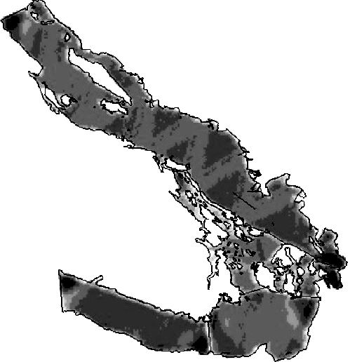

```{r setup, include=FALSE}
# setup
library(knitr)
library(magrittr)
library(viridis)
opts_chunk$set(cache=TRUE, echo=FALSE, warning=FALSE, error=FALSE,
               message=FALSE, fig.height=8, fig.width=10)

# some useful libraries
library(RColorBrewer)
library(ggplot2)
library(cowplot)
theme_set(theme_cowplot(20))

```

class: title-slide, inverse, center, middle

# What is a density surface model?

<div style="position: absolute; bottom: 15px; vertical-align: center; left: 10px">

</div>

---

class: inverse, middle, center

# Why model abundance spatially?

---
class: inverse, middle, center

# Maps
---

.pull-left[


]

.pull-right[
- Black bears in Alaska
- Heterogeneous spatial distribution

]

---
class: inverse, middle, center

# Spatial decision making

---

.pull-left[


]

.pull-right[
- Block Island, Rhode Island
- First offshore wind in the USA
- Spatial impact assessment


]

---

class: inverse, middle, center

# Biological insights

---
# 


---

class: inverse, middle, center

# Back to Horvitz-Thompson estimation

---

# Horvitz-Thompson-like estimators


- Rescale the (flat) density and extrapolate

$$
\hat{N} = \frac{\text{study area}}{\text{covered area}}\sum_{i=1}^n \frac{s_i}{\hat{p}_i}
$$

- $s_i$ are group/cluster sizes
- $\hat{p}_i$ is the detection probability (from detection function)

---

# Hidden in this formula is a simple assumption


- Probability of sampling every point in the study area is equal
- Is this true? Sometimes.
- If (and only if) the design is randomised

---

# Many faces of randomisation


```{r randomisation, fig.width=14, fig.height=4.5, out.width='\\textwidth'}
set.seed(12133)
par(mfrow=c(1,3), cex.main=2.5)

# true random sample
plot(c(0, 1), c(0, 1), type="n", xlab="", ylab="", axes=FALSE, asp=1, main="random placement")
dat <- data.frame(x=runif(10), y=runif(10))
angle <- runif(10, 0, 2*pi)
len <- 0.2
arrows(dat$x, dat$y, dat$x+len*cos(angle), dat$y+len*sin(angle), length=0)
dat <- data.frame(x=runif(10), y=runif(10))
angle <- runif(10, 0, 2*pi)
len <- 0.2
arrows(dat$x, dat$y, dat$x+len*cos(angle), dat$y+len*sin(angle), length=0, col="grey40", lty=2)
box()

# parallel random offset
plot(c(0, 1), c(0, 1), type="n", xlab="", ylab="", axes=FALSE, asp=1, main="random offset parallel lines")
abline(v=seq(0, 1, len=10))
abline(v=seq(0, 1, len=10)+0.07, col="grey40", lty=2)
box()

# random offset zigzag

## make a zigzag
n_segs <- 10
zz <- data.frame(x   = c(seq(0, 0.5, len=n_segs),
                         seq(0.5, 1, len=n_segs)),
                 y   = c(seq(0, 1, len=n_segs),
                         seq(1, 0, len=n_segs)))
# many zigzags
mzz <- rbind(zz,zz,zz)
mzz$x <- mzz$x/3
ind <- 1:nrow(zz)
mzz$x[ind+nrow(zz)] <- mzz$x[ind+nrow(zz)]+1/3
mzz$x[ind+2*nrow(zz)] <- mzz$x[ind+2*nrow(zz)]+2/3

plot(mzz, type="l", xlab="", ylab="", axes=FALSE, asp=1, main="random offset zigzag")
lines(mzz$x+0.06, mzz$y, col="grey40", lty=2)
box()
```


---

# Randomisation & coverage probability


- H-T equation above assumes even coverage
  - (or you can estimate)

  


---


# Extra information


```{r loadtracks, results="hide"}
library(rgdal)
tracksEN <- readOGR("../practicals/Analysis.gdb", "EN_Trackline1")
tracksGU <- readOGR("../practicals/Analysis.gdb", "GU_Trackline")
```
```{r plottracks, cache=FALSE}
library(ggplot2)
tracksEN <- fortify(tracksEN)
tracksGU <- fortify(tracksGU)
mapdata <- map_data("world2","usa")
p_maptr <- ggplot()+
      geom_path(aes(x=long,y=lat, group=group), colour="red", data=tracksEN) + 
      geom_path(aes(x=long,y=lat, group=group), colour="blue", data=tracksGU)+
      geom_polygon(aes(x=long,y=lat, group=group), data=mapdata)+
      coord_map(xlim=range(tracksEN$long, tracksGU$long)+c(-1,1),
                ylim=range(tracksEN$lat, tracksGU$lat)+c(-1,1))
print(p_maptr)
```

---


# Extra information - depth


```{r loadcovars, results="hide"}
library(raster)
predictorStack <- stack(c("../practicals/Covariates_for_Study_Area/Depth.img", "../practicals/Covariates_for_Study_Area/GLOB/CMC/CMC0.2deg/analysed_sst/2004/20040601-CMC-L4SSTfnd-GLOB-v02-fv02.0-CMC0.2deg-analysed_sst.img","../practicals/Covariates_for_Study_Area/VGPM/Rasters/vgpm.2004153.hdf.gz.img"))
names(predictorStack) <- c("Depth","SST","NPP")
```
```{r plotdepth}
load("../practicals/spermwhale.RData")
depthdat <- as.data.frame(predictorStack[[1]],xy=TRUE)
depthdat <- depthdat[!is.na(depthdat$Depth),]
library(plyr)
plotobs <- join(obs, segs, by="Sample.Label")
p <- ggplot() +
      geom_tile(aes(x=x, y=y, fill=Depth), data=depthdat) + 
      geom_point(aes(x=x, y=y, size=size), alpha=0.6, data=plotobs) +
      coord_equal() +
      scale_fill_viridis()
print(p)
```

---


# Extra information - depth

.pull-left[
```{r plotdepth-notspat, fig.width=10}
p <- ggplot(plotobs)+
       geom_histogram(aes(Depth, weight=size)) +
       xlab("Depth") + ylab("Aggregated counts")
print(p)
```
]

.pull-right[
- NB this only shows segments where counts > 0
]

---

# Extra information - SST


```{r plotsst, fig.width=10}
sstdat <- as.data.frame(predictorStack[[2]], xy=TRUE)
sstdat <- sstdat[!is.na(sstdat$SST),]
p <- ggplot() +
      geom_tile(aes(x=x, y=y, fill=SST), data=sstdat) + 
      geom_point(aes(x=x, y=y, size=size), alpha=0.6, data=plotobs) +
      coord_equal() + scale_fill_viridis()
print(p)
```


---


# Extra information - SST

.pull-left[
```{r plotsst-notspat, fig.width=10}
p <- ggplot(plotobs)+
       geom_histogram(aes(SST, weight=size), binwidth=1) +
       xlab("SST") + ylab("Aggregated counts")
print(p)
```
]

.pull-right[
- (only segments where counts > 0)
]

---

class: inverse, middle, center

# You should model that

---

# Modelling requirements


- Include detectability
- Account for effort
- Flexible/interpretable effects
- Predictions over an arbitrary area


---

class: inverse, middle, center

# Accounting for effort

---

# Effort

.pull-left[
```{r tracks2, fig.width=10}
print(p_maptr)
```
]

.pull-right[
- Have transects
- Variation in counts and covars along them
- Want a sample unit w/ minimal variation
- "Segments": chunks of effort
]

---


# Chopping up transects


[Physeter catodon by Noah Schlottman](http://phylopic.org/image/dc76cbdb-dba5-4d8f-8cf3-809515c30dbd/)


---

class: inverse, middle, center

# Flexible, interpretable effects


---


# Smooth response


```{r plotsmooths, messages=FALSE}
library(Distance)
library(dsm)
par(ps=20)
df <- ds(dist, truncation=6000)
dsm_tw_xy_depth <- dsm(count ~ s(x, y) + s(Depth), ddf.obj=df, observation.data=obs, segment.data=segs, family=tw())
plot(dsm_tw_xy_depth, select=2)
```


---

# Explicit spatial effects


```{r plot-spat-smooths, messages=FALSE}
vis.gam(dsm_tw_xy_depth, view=c("x","y"), plot.type="contour", main="", asp=1, too.far=0.06)
```


---

class: inverse, middle, center

# Predictions

---

# Predictions over an arbitrary area

.pull-left[

```{r predplot}
predgrid$Nhat <- predict(dsm_tw_xy_depth, predgrid)
p <- ggplot(predgrid) + 
      geom_tile(aes(x=x, y=y, fill=Nhat, width=10*1000, height=10*1000)) +
      coord_equal() +
      labs(fill="Density") +
      scale_fill_viridis()
print(p)
```
]

.pull-right[
- Don't want to be restricted to predict on segments
- Predict within survey area
- Extrapolate outside (with caution)
- Working on a grid of cells
]

---

class: inverse, middle, center

# Detection information

---

# Including detection information


- Two options:
  - adjust areas to account for **effective effort**
  - use **Horvitz-Thompson estimates** as response


---

# Effective effort


- Area of each segment, $A_j$
  - use $A_j\hat{p}_j$
- think effective strip width ( $\hat{\mu} = w\hat{p}$ )
- Response is counts per segment
- "Adjusting for effort"
- "Count model"


---

# Estimated abundance


- Estimate H-T abundance per segment
- Effort is area of each segment
- "Estimated abundance" per segment

$$
\hat{n}_j = \sum_i \frac{s_i}{\hat{p}_i}
$$

(where the $i$ observations are in segment $j$)

---

# Detectability and covariates


- 2 covariate "levels" in detection function
  - "Observer"/"observation" -- change **within** segment
  - "Segment" -- change **between** segments
- "Count model" only lets us use segment-level covariates
- "Estimated abundance" lets us use either


---

# When to use each approach?


- Generally "nicer" to adjust effort
- Keep response (counts) close to what was observed
- **Unless** you want observation-level covariates


---


# Availability, perception bias and more


- $\hat{p}$ is not always simple!
- Availability & perception bias somehow enter
- We can make explicit models for this
- More later in the course


---


# DSM flow diagram


---

class: inverse, middle, center

# Data requirements

---

# What do we need?


- Need to "link" data
  - ✅ Distance data/detection function
  - ✅ Segment data
  - ✅ Observation data (segments 🔗 detections)

---


---
class: inverse, middle, center

# Example data


---

# Example data


---


# Example data


---


# Sperm whales off the US east coast


.pull-left[

]
.pull-right[

- Hang out near canyons, eat squid
- Surveys in 2004, US east coast
- Combination of data from 2 NOAA cruises
- Thanks to Debi Palka (NOAA NEFSC), Lance Garrison (NOAA SEFSC) for data. Jason Roberts (Duke University) for data prep.
]

---

# Recap


- Model counts or estimated abundance
- The effort is accounted for differently
- Flexible models are good
- Incorporate detectability
- 2 tables + detection function needed

