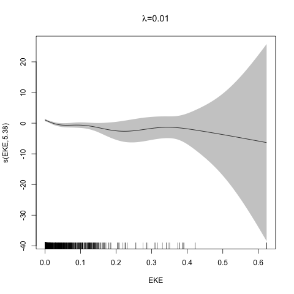
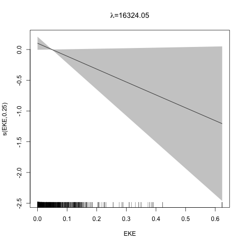
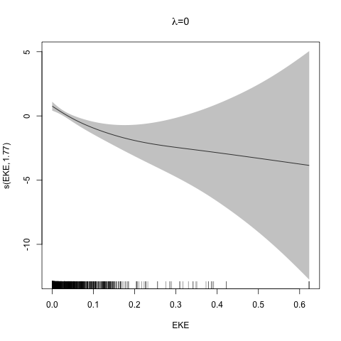

```{r setup, include=FALSE}
# setup
library(knitr)
library(magrittr)
library(viridis)
library(reshape2)
library(animation)
opts_chunk$set(cache=TRUE, echo=FALSE, warning=FALSE, error=FALSE,
               message=FALSE, fig.height=8, fig.width=10)

# some useful libraries
library(RColorBrewer)
library(ggplot2)
library(cowplot)
theme_set(theme_cowplot(20))

```

class: title-slide, inverse, center, middle

# Multivariate smoothing<br/>&<br/>model selection
<div style="position: absolute; bottom: 15px; vertical-align: center; left: 10px">

</div>

---


```{r initialmodeletc, echo=FALSE, message=FALSE, warning=FALSE, cache=FALSE}
load("../practicals/spermwhale.RData")
library(Distance)
library(dsm)
library(mgcv)
df_hr <- ds(dist, truncation=6000, key="hr")
dsm_tw_xy_depth <- dsm(count ~ s(x, y) + s(Depth), ddf.obj=df_hr, observation.data=obs, segment.data=segs, family=tw())
```


# Recap


- How GAMs work
- How to include detection info
- Simple spatial-only models
- How to check those models


---
class: inverse, middle, center

# Univariate models are fun, but...

---


# Ecology is not univariate


- Many variables affect distribution
- Want to model the **right** ones
- Select between possible models
  - Smooth term selection
  - Response distribution
- Large literature on model selection

---
class: inverse, middle, center

# Models with multiple smooths

---

# Adding smooths


- Already know that `+` is our friend
- Can build a big model...

```{r add-all, echo=TRUE}
dsm_all <- dsm(count~s(x, y) +
                     s(Depth) +
                     s(DistToCAS) +
                     s(SST) +
                     s(EKE) +
                     s(NPP),
                  ddf.obj=df_hr,
                  segment.data=segs, observation.data=obs,
                  family=tw())
```

---
class: inverse, middle, center

# Now we have a huge model, what do we do?

---

# Term selection


.pull-left[
- Two popular approaches (use $p$-values)

**Stepwise selection** - path dependence

**All possible subsets** - computationally expensive (fishing?)
]
.pull-right[

]

---

# p-values

- Test for *zero effect* of a smooth
- They are **approximate** for GAMs (but useful)
- Reported in `summary`

---

# p-values example

```{r p-summary}
summary(dsm_all)
```

---

class: inverse, middle, center

# Path dependence is an issue here

---

# Term selection during fitting


```{r term-select, results="hide"}
dats <- dsm_all$dat
goodfit <- gam(count~s(EKE), data=dats, family=tw())
bestlambda <- goodfit$sp

plot_lambda <- function(G, lambdae){

  for(new_lambda in (seq(0.1, sqrt(100*lambdae[1]), len=50))^2){
    this_fit <- gam(count~s(EKE), data=dats, family=tw(),
                    sp=c(new_lambda))
    plot(this_fit, select=1,
         main=substitute(paste(lambda, "=", new_lambda),
                         list(new_lambda=new_lambda)), shade=TRUE)
    ani.pause()
  }
  for(i in 1:3){
    plot(this_fit, select=1,
         main=substitute(paste(lambda, "=", new_lambda),
                         list(new_lambda=new_lambda)), shade=TRUE)
    ani.pause()
  }

}

saveGIF(plot_lambda(G, bestlambda), "images/shrinky_dink.gif", interval=0.2)

```
.pull-left[
- Penalty already removes complexity from model
- What about using it to remove the whole term?
]
.pull-right[

]


---

# Shrinkage approach


```{r term-select-ts, results="hide"}
dats <- dsm_all$dat
goodfit <- gam(count~s(EKE, bs="ts"), data=dats, family=tw())
bestlambda <- goodfit$sp

plot_lambda <- function(G, lambdae){

  for(new_lambda in (seq(lambdae[1], sqrt(10000*lambdae[1]), len=50))^2){
    this_fit <- gam(count~s(EKE, bs="ts"), data=dats, family=tw(),
                    sp=c(new_lambda))
    plot(this_fit, select=1,
         main=substitute(paste(lambda, "=", new_lambda),
                         list(new_lambda=new_lambda)), shade=TRUE)
    ani.pause()
  }

  for(i in 1:3){
    plot(this_fit, select=1,
         main=substitute(paste(lambda, "=", new_lambda),
                         list(new_lambda=new_lambda)), shade=TRUE)
    ani.pause()
  }
}

saveGIF(plot_lambda(G, bestlambda), "images/shrinky_dink_ts.gif", interval=0.2)

```
.pull-left[
- Basis `s(..., bs="ts")` - thin plate splines *with shrinkage*
- remove the wiggles **then** remove the "linear" bits
- nullspace should be shrunk less than the wiggly part
]
.pull-right[

]


---

# Shrinkage example

```{r add-ts, echo=TRUE}
dsm_ts_all <- dsm(count~s(x, y, bs="ts") +
                        s(Depth, bs="ts") +
                        s(DistToCAS, bs="ts") +
                        s(SST, bs="ts") +
                        s(EKE, bs="ts") +
                        s(NPP, bs="ts"),
                  ddf.obj=df_hr,
                  segment.data=segs, observation.data=obs,
                  family=tw())
```

---

# Model with no shrinkage


```{r smooth-no-shrinkage, fig.width=15}
plot(dsm_all, pages=1, scale=0)
```
---

# ... with shrinkage

```{r smooth-shrinkage, fig.width=15}
plot(dsm_ts_all, pages=1, scale=0)
```

---

# Shrinkage in action

```{r ts-summary, echo=TRUE}
summary(dsm_ts_all)
```

---

# Alternative: extra penalty


```{r term-select-select, results="hide"}
dats <- dsm_all$dat
goodfit <- gam(count~s(EKE), select=TRUE, data=dats, family=tw())
bestlambda <- goodfit$sp

plot_lambda_s <- function(G, lambdae){

  for(new_lambda in (seq(0, sqrt(lambdae[2]), len=50))^2){
    this_fit <- gam(count~s(EKE), select=TRUE, data=dats, family=tw(),
                    sp=c(lambdae[1], new_lambda))
    plot(this_fit, select=1,
         main=substitute(paste(lambda, "=", new_lambda),
                         list(new_lambda=new_lambda)), shade=TRUE)
    ani.pause()
  }

  for(i in 1:3){
    plot(this_fit, select=1,
         main=substitute(paste(lambda, "=", new_lambda),
                         list(new_lambda=new_lambda)), shade=TRUE)
    ani.pause()
  }
}

saveGIF(plot_lambda_s(G, bestlambda), "images/shrinky_dink_select.gif", interval=0.2)

```
.pull-left[
- `dsm(..., select=TRUE)` - extra penalty
- no assumption of how much to shrink the nullspace
- "no assumption" might not be such a good idea?
]
.pull-right[

]

---

# Extra penalty example

```{r add-select, echo=TRUE}
dsm_sel <- dsm(count~s(x, y) +
                     s(Depth) +
                     s(DistToCAS) +
                     s(SST) +
                     s(EKE) +
                     s(NPP),
                  ddf.obj=df_hr,
                  segment.data=segs, observation.data=obs,
                  family=tw(), select=TRUE)
```


---

# Extra penalty example


```{r select-summary, echo=TRUE}
summary(dsm_sel)
```


---

# Extra penalty example

```{r smooth-sel, fig.width=15}
plot(dsm_sel, pages=1, scale=0)
```

---

# EDF comparison


```{r edf-comp, result="asis"}
aa <- cbind(summary(dsm_all)$edf,
            summary(dsm_sel)$edf,
            summary(dsm_ts_all)$edf)
rownames(aa) <- rownames(summary(dsm_sel)$s.table)
colnames(aa) <- c("allterms", "select", "ts")
kable(round(aa, 4), digits=4, format="html")
```


---

# Double penalty can be slow


- Lots of smoothing parameters to estimate

```{r numberofsmoopars, echo=TRUE}
length(dsm_ts_all$sp)
length(dsm_sel$sp)
```


---

# How do we select smooth terms?

1. Look at EDF
  - Terms with EDF<1 may not be useful (can we remove?)
2. Remove non-significant terms by $p$-value
  - Decide on a significance level and use that as a rule

(In some sense leaving "shrunk" terms in is more "consistent" in terms of variance estimation, but can be computationally annoying)


---


class: inverse, middle, center

# Comparing models

---

# Comparing models


- Usually have >1 option
- How can we pick?
- Even if we have 1 model, is it any good?


---

# Nested vs. non-nested models


- Compare `~s(x)+s(depth)` with `~s(x)`
  - nested models
- What about `s(x) + s(y)` vs. `s(x, y)`
  - don't want to have all these in the model
  - not nested models


---

# Measures of "fit"


- Two listed in `summary`
  - Deviance explained
  - Adjusted $R^2$ (not useful)
- Deviance is a generalisation of $R^2$
- Highest likelihood value (*saturated* model) minus estimated model value
- (These are usually not very high for DSMs)


---

# AIC


- Can get AIC from our model
- Comparison of AIC fine (but not the end of the story)

```{r aic, echo=TRUE}
AIC(dsm_all)
AIC(dsm_ts_all)
```

---

# A quick note about REML scores

- Use REML to select the smoothness
- Can also use the score to do model selection
- **BUT** only compare models with the same fixed effects
  - (i.e., same "linear terms" in the model)
- $\Rightarrow$ **All terms** must be penalised
  - `bs="ts"` or `select=TRUE`


---

class: inverse, middle, center

# Selecting between response distributions

---

# Goodness of fit tests


- Q-Q plots
- Closer to the line == better
```{r gof-qq, fig.width=18}
dsm_x_nb <- dsm(count~s(x, bs="ts"),
                ddf.obj=df_hr,
                segment.data=segs, observation.data=obs,
                family=nb(), method="REML")
par(mfrow=c(1,2), cex.title=3, cex.axis=1.5, cex.lab=1.5, lwd=2)
qq.gam(dsm_all, asp=1, main="Tweedie", cex=5)
qq.gam(dsm_x_nb, asp=1, main="Negative binomial", cex=5)
```


---

class: inverse, middle, center

# Tobler's first law of geography

## *"Everything is related to everything else, but near things are more related than distant things"*

### Tobler (1970)


---

# Implications of Tobler's law


```{r pairrrrs, fig.width=10}
plot(segs[, c("x","y","SST","EKE","NPP","Depth")], pch=19, cex=0.4)
```


---

class: inverse, middle, center


## Covariates are not only correlated (linearly)...<br/><br/>...they are also "concurve"

### *"How much can one smooth be approximated by one or more other smooths?"*


---

# Concurvity (model/smooth)


```{r concurvity, echo=TRUE}
concurvity(dsm_all)
```

---

# Concurvity between smooths

```{r concurvity-all, echo=TRUE}
concurvity(dsm_all, full=FALSE)$estimate
```

---

# Visualising concurvity between terms

.pull-left[
```{r concurvity-all-vis}
vis.concurvity(dsm_ts_all)
```
]

.pull-right[
- Previous matrix output visualised
- High values (yellow) = BAD
]


---
class: inverse, middle, center

# Path dependence


---

# Sensitivity


- General path dependency?
- What if there are highly concurve smooths?
- Is the model is sensitive to them?


---

# What can we do?


- Fit variations excluding smooths
  - Concurve terms that are excluded early on
- Appendix of Winiarski et al (2014) has an example


---


# Sensitivity example


- `s(Depth)` and `s(x, y)` are highly concurve (`r round(concurvity(dsm_ts_all, full=FALSE)$estimate[2,3],4)`)
- Refit removing `Depth` first

```{r nodepth}
dsm_no_depth <- dsm(count~s(x, y, bs="ts") +
                          s(DistToCAS, bs="ts") +
                          s(SST, bs="ts") +
                          s(EKE, bs="ts") +
                          s(NPP, bs="ts"),
                      ddf.obj=df_hr,
                      segment.data=segs, observation.data=obs,
                      family=tw(), method="REML")
```
```{r sensitivity-anova}
cat("# with depth")
summary(dsm_ts_all)$s.table
cat("# without depth")
summary(dsm_no_depth)$s.table
```


---

# Comparison of spatial effects


```{r sensitivity-vis, fig.width=18}
par(mfrow=c(1,2))
vis.gam(dsm_ts_all, view=c("x","y"), plot.type="contour", main="s(x,y) + s(Depth)", asp=1, too.far=0.1, zlim=c(-6, 2))
vis.gam(dsm_no_depth, view=c("x","y"), plot.type="contour", main="s(x,y)+s(EKE)+s(NPP)", asp=1, too.far=0.1, zlim=c(-6, 2))
```


---

# Sensitivity example


- Refit removing `x` and `y`...

```{r noxy}
dsm_no_xy <- dsm(count~
                        s(DistToCAS, bs="ts") +
                        s(SST, bs="ts") +
                        s(Depth, bs="ts") +
                        s(EKE, bs="ts") +
                        s(NPP, bs="ts"),
                      ddf.obj=df_hr,
                      segment.data=segs, observation.data=obs,
                      family=tw(), method="REML")
```
```{r sensitivity-anova-noxy, fig.width=12}
cat("# without xy")
summary(dsm_no_xy)$s.table
cat("# with xy")
summary(dsm_ts_all)$s.table
```


---

# Comparison of depth smooths


```{r sensitivity-depth, fig.width=12}
par(mfrow=c(1,2))
plot(dsm_ts_all, select=2, ylim=c(-5,5))
plot(dsm_no_xy, select=3, ylim=c(-5,5))
```


---

# Comparing those three models...


```{r sensitivity-table, results="asis"}
sens <- data.frame(Model    = c("`all`",
                                "`s(x,y)+s(EKE)+s(NPP)`",
                                "`s(SST)+s(Depth)`"),
                   AIC      = c(AIC(dsm_ts_all),
                                AIC(dsm_no_depth),
                                AIC(dsm_no_xy)),
                   Deviance = c(summary(dsm_ts_all)$dev.expl,
                                summary(dsm_no_depth)$dev.expl,
                                summary(dsm_no_xy)$dev.expl))
sens$Deviance <- sens$Deviance*100
sens[,2] <- round(sens[,2],4)
sens[,3] <- round(sens[,3],2)

kable(sens, format="html")
```

- "Full" model still explains most deviance
- No depth model requires spatial smooth to "mop up" extra variation
- We'll come back to this when we do prediction


---
class: inverse, middle, center

# Recap

---


# Recap


- Adding smooths
- Removing smooths
  - $p$-values
  - shrinkage/extra penalties
- Comparing models
- Comparing response distributions
- Sensitivity


