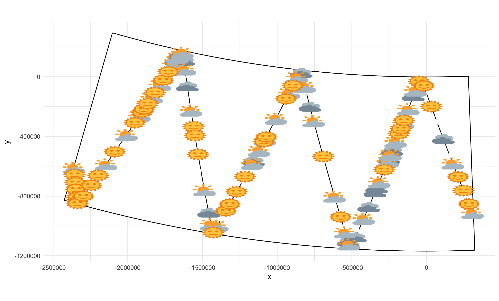
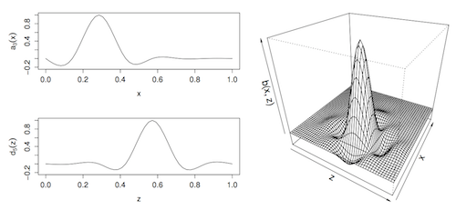

```{r setup, include=FALSE}
# setup
library(knitr)
library(magrittr)
library(viridis)
library(reshape2)
library(animation)
opts_chunk$set(cache=TRUE, echo=FALSE, warning=FALSE, error=FALSE,
               message=FALSE, fig.height=8, fig.width=10)

# some useful libraries
library(RColorBrewer)
library(ggplot2)
library(cowplot)
theme_set(theme_cowplot(20))

```

class: title-slide, inverse, center, middle

# Practical advice

<div style="position: absolute; bottom: 15px; vertical-align: center; left: 10px">

</div>

---

class: inverse, center, middle

# Real survey data is messy


---


# Distance sampling in the Real World


- We've talked a lot about models
- We've also talked about assumptions
- Our example is relatively well-behaved
- What can we do about all the nasty real world stuff?


---

# Aims

- Here we want to cover common questions
- Not definitive answers
- Some guidance on where to look for answers

---

class: inverse, center, middle

# What should my sample size be?

---

# What do we mean by "sample size"?


- Number of animal (groups) recorded
  - *detection function*
- Number of segments
  - *spatial model*
- Number of segments with observations
  - *spatial model*


---

class: inverse, center, middle

# Re-frame

---

# How would we know when we have enough samples?


- We don't
- Heavily context-dependent
- Go back to assumptions


---

# "How many data?"


```{r df-obs, echo=FALSE, fig.width=15, fig.height=9}
library(Distance)
#set.seed(21)
set.seed(321)
dist1 <- abs(rnorm(30,sd=0.2))
mod1 <- ds(data.frame(distance=dist1, object=1:length(dist1)), adjustment=NULL)

dist2 <- c(abs(rnorm(250,sd=0.02)),
           abs(rnorm(750,sd=0.5)))
mod2_full <- ds(data.frame(distance=dist2, object=1:length(dist2)), adjustment=NULL)
mod2_05 <- ds(data.frame(distance=dist2, object=1:length(dist2)), adjustment=NULL, truncation=0.5)
mod2_004 <- ds(data.frame(distance=dist2, object=1:length(dist2)), adjustment=NULL, truncation=0.04)

par(mfrow=c(2,3))
plot(mod1, mainshowpoints=FALSE, pl.den=0)
title(main="n=30", cex.main=5) 
plot(1:10, axes=FALSE, type="n", ylab="", xlab="", showpoints=FALSE, pl.den=0)
plot(1:10, axes=FALSE, type="n", ylab="", xlab="", showpoints=FALSE, pl.den=0)
plot(mod2_full, showpoints=FALSE, pl.den=0)
title(main="n=1000", cex.main=5) 
plot(mod2_05, showpoints=FALSE, pl.den=0)
title(main="n=747", cex.main=5) 
plot(mod2_004, showpoints=FALSE, pl.den=0)
title(main="n=273", cex.main=5) 
```


---


# Pilot studies and "you get what you pay for"


- Designing surveys is hard
- Designing surveys is essential

- Better to fail one season than fail for 5, 10 years
- Get information early, get it cheap
  - Inform design from a pilot study


---

# Avoiding rules of thumb


- Think about assumptions
  - Detection function
  - Spatial model
- Think about design
  - Spatial coverage
  - Covariate coverage


---

# Spatial coverage (IWC POWER)


---


# Covariate coverage


```{r coverage, fig.width=12, echo=FALSE}
library(dsm)
load("../practicals/spermwhale.RData")
df_hr <- ds(dist, truncation=6000, key="hr")
# fit a quick model from previous exericises
dsm_all_tw_rm <- dsm(count~s(x, y, bs="ts") +
                           s(Depth, bs="ts"),
                     ddf.obj=df_hr,
                     segment.data=segs, observation.data=obs,
                     family=tw(), method="REML")
exclude_fn <- function(top, bottom){
  segs2 <- segs[(segs$Depth >0 & segs$Depth<bottom) | (segs$Depth<5200 & segs$Depth>top),]
  dsm_a <- dsm(count~s(Depth, bs="ts"),
               ddf.obj=df_hr,
               segment.data=segs2, observation.data=obs,
               family=tw(), method="REML")
  plot(dsm_a, scale=0, main=paste0(">",top," and <", bottom), xlim=c(0,5200))
}

par(mfrow=c(1,3), cex.main=2, cex.lab=2, cex.axis=2,
    lwd=2, mar=c(5,6,4,2) + 0.1)
exclude_fn(0, Inf)  
exclude_fn(3000, 1000)  
exclude_fn(5000, 3000)  
```

---


# Sometimes things are complicated


- Weather has a big effect on detectability
- Need to record during survey
- Disambiguate between distribution/detectability
- Potential confounding can be BAD


---


# Visibility during POWER 2014




Thanks to Hiroto Murase and co. for this data!


---

# Covariates can make a big difference!


---


# Disappointment


- Sometimes you don't have enough data
- Or, enough coverage
- Or, the right covariates
<br/>
<br/>
<br/>
<div class="medq", align="center">Sometimes, you can't build a spatial model</div>


---

class: inverse, center, middle


[@kitabet](http://twitter.com/kitabet)


---

class: inverse, center, middle

# "Which of options X, Y, Z is correct?"

---

# Alternatives problem


- When faced with options, try them.
- **Where** does the sensitivity lie?
- What's **really** going on?
- What is your **objective**?


---

class: inverse, center, middle

# "How big should our segments be?"

---


# Segment size


- If you think it's an issue test it
- Resolution of covariates also important
- Maybe species-/domain-dependent?
- (Solutions on the horizon to avoid this)


---

class: inverse, center, middle

# "Is our model right?"

---


# Model validation


- Some variety of cross-validation
- Temporal replication
  - Leave out 1 year, fit to others, predict, assess
- Spatial "pseudo-jackknife"
  - Leave out every $n^{th}$ segment, refit, ...
  - (Maybe leave out 2, 3 etc...)


---

class: inverse, center, middle

# Modelling philosophy


---

# Which covariates should we include?


- Dynamic vs static variables
- Spatial terms? Habitat models?


---

class: inverse, center, middle

# Getting help

---

# Resources


- Bibliography has pointers to these topics
- Distance sampling Google Group
  - Friendly, helpful, low traffic
  - see [distancesampling.org/distancelist.html](http://distancesampling.org/distancelist.html)


---

class: inverse, center, middle

# Advanced topics

---

class: inverse, center, middle

# This is a whirlwind tour...


---

class: inverse, center, middle

# ...and some of this is experimental


---

class: inverse, center, middle

# Smoother zoo


---


# Cyclic smooths


- What if things "wrap around"? (Time, angles, ...)
- Match value and derivative
- Use `bs="cc"`
- See `?smooth.construct.cs.smooth.spec`


---


# Smoothing in complex regions

.pull-left[
- Edges are important
- Whales don't live on land
- Bad things happen when we don't account for this
- Include boundary info in smoother 
- `?soap`
]
.pull-right[

]


---

# Multivariate smooths


- Thin plate splines are *isotropic*
- 1 unit in any direction is equal
- Fine for space, not for other things


---

# Tensor products


- $s_{x,z}(x,z) = \sum_{k_1}\sum_{k_2} \beta_k s_x(x)s_z(z)$
- As many covariates as you like! (But takes time)
- `te()` or `ti()` (instead of `s()`)




---

# Black bears like to sunbathe


---

# Random effects


- normal random effects
- exploits equivalence of random effects and splines `?gam.vcomp`
- useful when you just have a “few” random effects
- `?random.effects`


---

class: inverse, center, middle

# Making things faster

---

# Parallel processing


- Some models are very big/slow
- Run on multiple cores
- Use `engine="bam"`!
- Some constraints in what you can do
- Wood, Goude and Shaw (2015)


---

# Summary


- Lots of complicated problems
- Lots of potential solutions
- (see also "other approaches" mini-lecture)
- Need to get simple things right first
- **Trade assumptions for data**


