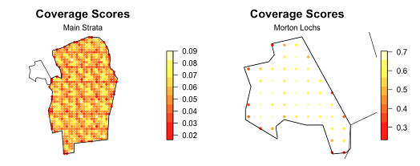

```{r, include=FALSE, message=FALSE}
knitr::opts_chunk$set(echo = TRUE)
```

# Introduction

We provide two exercises in survey design so you can choose the one you feel is most useful to you. The first example involves designing a line transect survey to estimate the abundance of porpoise, common dolphins and seals in and around St Andrews Bay. It considers how you choose your design based on effort limitations. It also compares an aerial survey based on systematic parallel lines with a boat based survey using zigzags. The second example involves designing a point transect bird survey in Tentsmuir Forest. This looks at how to project your study area from latitude and longitude on to a flat plane using R. It also involves defining a design for multiple strata with different coverage in each strata. 

# Systematic parallel line aerial survey of marine mammals in St Andrews bay

**The objective of this exercise is to decide on a systematic line spacing which uses as much of the 250 km of available effort as possible without risking not being able to complete the survey. We must remember that some of the 250 km will be spent travelling off-effort between transects.**

This project involves designing an aerial survey of porpoise, common dolphins and seals in and around St Andrews bay. (For locals: the nearer St Andrews bay region has been extended in an easterly direction out past Bell Rock, as there are some pockets of deeper water out there that are of interest with regard to the distribution of cetaceans. The survey region has a chunk missing due to a no-fly zone around Buddo Ness, just below Carnoustie).

Before we begin we must load the distance sampling survey design R library. 

```{r loadlib}
library(dssd)
```

## Study Region

First of all we will set up the study region and plot it. The shapefile for this study area is contained within the *dssd* R library. This shapefile has already been projected from latitude and longitude on to a flat plane and its units are in metres. The first line of code below obtains the pathway for the shapefile within the R library and may vary on different computers. You will then pass this shapefile pathway to the *make.region* function to set up the survey region. As this shapefile does not have a projection (.prj) file associated with it we should tell *dssd* the units (m) when we create the survey region.

```{r region, fig.align='center', fig.cap="Study Region", fig.width=4, fig.height=4.5}
#Find the pathway to the file
shapefile.name <- system.file("extdata", "StAndrew.shp", package = "dssd")
#Create the region using this shapefile
region <- make.region(region.name = "St Andrews Bay",
                      units = "m",
                      shape = shapefile.name)
#Plot the region
plot(region)
```

## Coverage

The next step is to set up a coverage grid. A coverage grid is a grid of regularly spaced points and is used to assess whether each point in the survey region is equally likely to sampled. The coverage grid needs to be created before the coverage simulation is run. 

```{r coveragegrid}
# Set up coverage grid
cover <- make.coverage(region, n.grid.points = 500)
```

## Systematic Parallel Design

The small survey plane available can complete a total flight time of around 250 km (excluding the flight time to and from the landing strip in Fife Ness). Generally, systematic parallel line designs are preferable for aerial surveys as they allow some rest time for observers as the plane travels between transects and avoids the sharp turns associated with zigzag designs.

Firstly, we will consider the design angle. Often animal density is affected by distance to coast so it is probably wise for this survey to orientate lines approximately perpendicular to the coast. To do this we can select a design angle of 90 degrees. We can therefore expect to spend a little more than 40 km (the height of the survey region) on off-effort transit time and might hope to be able to complete around 200 km of transects. *dssd* lets us specify the desired line length as a design parameter and will then choose an appropriate value for transect spacing. We will choose a minus sampling strategy and set the truncation distance to 2 km. Note that as our survey region coordinates are in metres we also need to supply the design parameters in metres. 

```{r design}
# Define the design
design.LL200 <- make.design(region = region,
                      transect.type = "line",
                      design = "systematic",
                      line.length = 200000,
                      design.angle = 90,
                      edge.protocol = "minus",
                      truncation = 2000,
                      coverage.grid = cover)

```

Now we have defined the design we should check it visually by creating a survey (a single set of transects).

```{r setseed, echo = FALSE}
# I set a seed so that my figures matched the txt you shouldn't run this!
set.seed(263)
```

```{r survey, fig.cap="Single survey generated from the systematic parallel line design", fig.width=4, fig.height=4.5, fig.pos='[!h]'}
# Create a single survey from the design
survey.LL200 <- generate.transects(design.LL200)
# Plot the region and the survey
plot(region, survey.LL200)
```

We can see that the survey consists of parallel systematically spaced transects running horizontally across the survey region roughly perpendicular to the coast as we wanted. We can also view the details of the survey which will tell us what spacing *dssd* used to try and achieve a line length of 200 km.

\newpage

```{r surveydetails}
# Display the survey details
survey.LL200
```

We can see that the spacing used by *dssd* was 4937.5 m which gives us 8 samplers and a coverage of just under 80%. In addition, this example survey has a line length of just under 200 km and a trackline length of just over 248 km. However, given the random nature of the design and the fact that the width of the study region is not constant everybody should get slightly different values. Although my trackline length was just under 250 km  it is not sufficient to only look at one survey, we need to know that all surveys under this design will have a trackline length of < 250 km.

To assess the design statistics across many surveys we will now run a coverage simulation. This simulation will randomly generate many surveys from our design and record coverage as well as various statistics including line length and trackline length. As we know that coverage for a parallel line design is largely uniform (apart from edge effects due to minus sampling) we do not need to run too many repetitions, 100 should be sufficient to give us an indication of the range of line lengths and trackline lengths for this design.

```{r runcoverage, eval=FALSE}
# Run the coverage simulation
design.LL200 <- run.coverage(design.LL200, 
                             reps = 100)
design.LL200
```

After you have run the coverage simulation take a look at the design statistics. The mean line length should be around 200 km (200,000 m). Now look at the maximum trackline length, we need this value to be less than 250 km (250,000 m). 

Use the results of this simulation to create some new designs based on various spacings to find the maximum line length that can be achieved without risking exceeding the maximum trackline length of 250 km (remember to generate a line length of 200 km *dssd* selected a spacing of 4938m). Maybe try spacings of 5000 m or 5500 m.

```{r designspacing, eval=FALSE}
# Define the design
design.space500 <- make.design(region = region,
                      transect.type = "line",
                      design = "systematic",
                      spacing = 5000,
                      design.angle = 90,
                      edge.protocol = "minus",
                      truncation = 2000,
                      coverage.grid = cover)

```

*\textcolor{blue}{What spacing would you select for this design? What is the maximum trackline length for the design you have selected? What on-effort line length are we likely to achieve?}*

## Zigzag Design

Zzigzag designs are often more efficient in their use of effort having less off-effort transit time between transects. For this survey another option would be to complete a boat-based survey. Let's say that we will have the same total effort available allowing us a trackline length of 250 km.

Let us now define a zigzag design for the same region. For zigzag designs the design angle has a different definition, it describes the angle across which the zigzags are constructed. For this example we want a vertical design angle so we will set it to 0. Zigzag designs also require an additional argument as zigzags can only be created inside convex shapes. We therefore need to specify the bounding shape, here we will choose a convex hull as it is more efficient than a minimum bounding rectangle. A convex hull works as if we were stretching an elastic band around the survey region. The code below shows you how to create the zigzag design, you should then create a single realisation of this design and plot it to check it looks ok.

```{r zzdesign, eval=TRUE, fig.cap="Single survey generated from the equal spaced zigzag design", fig.width=4, fig.height=4.5, fig.pos='[!h]'}
# Define the zigzag design
design.zz.4500 <- make.design(region = region,
                      transect.type = "line",
                      design = "eszigzag",
                      spacing = 4500,
                      design.angle = 0,
                      edge.protocol = "minus",
                      bounding.shape = "convex.hull",
                      truncation = 2000,
                      coverage.grid = cover)

survey.zz <- generate.transects(design.zz.4500)
plot(region, survey.zz)
```

Next we will run a coverage simulation to verify that we have stayed within the restraints of our survey effort; a total trackline length of < 250 km. This time when we run the coverage simulation we will ask it to complete more repetitions so we can also assess the coverage. 

First we can output the design statistics. *\textcolor{blue}{Does this design meet our survey effort constraint? What is the maximum total trackline length for this design? What line length are we likely to achieve with this design? Is this higher or lower than the systematic parallel design?}*

```{r zzcoverage, eval = FALSE}
# Run the coverage simulation
design.zz.4500 <- run.coverage(design.zz.4500, reps = 500)
# Display the design statistics
design.zz.4500
```

Next we can check the coverage. Sometimes with zigzag surveys generated inside convex hulls we can get areas of higher coverage in narrower parts of the survey region at either end of the design axis. One of the easiest ways to assess coverage is visually by plotting the coverage grid.

```{r zzcoverageplot, eval = FALSE}
# Plot the coverage grid
plot(design.zz.4500)
```

*\textcolor{blue}{Do you think the coverage scores look uniform across the study region? Where are they higher / lower? Why do you think this is?}* Note, you can go back to one of your parallel line designs and plot the coverage scores to compare (although there are fewer repetitions you can still get an idea of coverage).

\newpage

# Point Transect Bird Survey in Tentsmuir Forest

**The objective of this exercise is to design a point transect survey looking at songbird abundance in Tentsmuir Forest so that separate estimates of abundance can be obtained for the two strata.**

Tenstsmuir Forest is a mature pine forest located on the east coast of Scotland and is a 20 minute drive north of St Andrews. The western area of Tentsmuir around Morton Lochs is of special interest in this study as this part of the forest forms part of the Tentsmuir National Nature Reserve. This study region has therefore been divided into two stratum, the first is the main part of the forest and the second is the area of forest adjacent to Morton Lochs.

Before we begin we must load the distance sampling survey design R library and also the spatial library *sf*. The *sf* library needs to be loaded in this example as we need to project the survey region.

```{r loadlib2}
library(dssd)
library(sf)
```

## Projecting your Study Region

This exercise demonstrates how to deal with unprojected shapefiles. Study areas should always be projected onto a flat plane before you use them to design your survey. This is because in most parts of the world one degree latitude is not the same in distance as one degree longitude. If we didn't project, our study region and any surveys generated in it, would be distorted possibly leading to non-uniform coverage.

We will now load the study region and project it onto a flat plane using an Albers Equal Area Conical projection. As we have to project the shapefile we load the shape object separately instead of directly into a region object.

```{r loadshapefile}
#Load the unprojected shapefile
shapefile.name <- system.file("extdata", "TentsmuirUnproj.shp", package = "dssd")
sf.shape <- read_sf(shapefile.name)
# Check current coordinate reference system
st_crs(sf.shape)
# Define a European Albers Equal Area projection
proj4string <- "+proj=aea +lat_1=56 +lat_2=62 +lat_0=50 +lon_0=-3 +x_0=0 
                +y_0=0 +ellps=intl +units=m"
# Project the study area on to a flat plane
projected.shape <- st_transform(sf.shape, crs = proj4string)
```

We can now create the region object for *dssd* using the projected shape and plot it to check what it looks like. 

```{r makeregion, fig.cap="Tentsmuir Forest: showing the main stratum and the Morton Loch stratum.", fig.width=6, fig.height=5}
# Create the survey region in dssd
region.tm <- make.region(region.name = "Tentsmuir",
                         strata.name = c("Main Area", "Morton Lochs"),
                         shape = projected.shape)
# Plot the survey region
plot(region.tm)
```

## Coverage

The next step is to set up a coverage grid. A coverage grid is a grid of regularly spaced points and is used to assess whether each point in the survey region is equally likely to sampled. The coverage grid needs to be created before the coverage simulation is run. 

```{r coveragegridtm}
# Set up coverage grid
cover.tm <- make.coverage(region.tm, n.grid.points = 1000)
```

## Design

You are now going to set up a systematic point transect design. We will assume that we have sufficient resources to survey 40 point transects. As the Morton Lochs stratum is of special interest we will give it higher coverage. We will therefore explicitly allocate 25 samplers to the main stratum and 15 to the Morton Lochs stratum (note that the area of the Morton Lochs stratum is much small than the main stratum). If we wanted to allocate the same effort to both stratum we could provide the samplers argument with the single value of 40 and it would divide the effort equally between the strata. We will leave the design angle as 0 and set the truncation distance to 100 m. We will use a minus sampling approach at the edges.

*\textcolor{blue}{What are the analysis implications of a design with unequal coverage?}*

```{r pointdesign, eval = TRUE}
# Set up a multi strata systematic point transect design
design.tm <- make.design(region = region.tm,
                         transect.type = "point",
                         design = "systematic",
                         samplers = c(25,15),
                         design.angle = 0,
                         edge.protocol = "minus",
                         truncation = 100,
                         coverage.grid = cover.tm)

```

## Generate a Survey

You will now generate a single survey from this design and plot it inside the survey region to check what it looks like. If you want to check whether the covered areas of the samplers in the Morton Lochs stratum overlap add the argument *'covered.area = TRUE'* to the plot function.

```{r surveytm, fig.cap="Single survey generated from the systematic parallel line design", fig.width=4, fig.height=4.5}
# Create a single survey from the design
survey.tm <- generate.transects(design.tm)
# Plot the region and the survey
plot(region.tm, survey.tm, covered.area = TRUE)
```

Now look at the survey information. *\textcolor{blue}{What spacing was used in each strata to try and acheive the desired number of samplers? Did your survey achieve exactly the number of samplers you requested? Check if your neighbours achieved exactly the number of samplers requested. How much does coverage differ between the two strata for this realisation?}*

```{r surveyinfo, results = 'hide'}
# Display survey information
survey.tm
```

## Assessing Coverage and Design Statistics

We will now run a coverage simulation to assess how much the number of sampers and average coverage varies between surveys. We will also be able to assess how coverage varies spatially to see if edge effects are of concern.

First of all view the design statistics. *\textcolor{blue}{What is the minimum number of samplers you will achieve in each strata? Is this sufficient to complete separate analyses in each stratum?}*

Next plot the coverage scores. *\textcolor{blue}{Does it appear that there is even coverage within each strata?}* As there is such a difference in the range of coverage scores between strata you may need to plot each strata individually.

```{r coveragetm, eval = TRUE, results='hide'}
# Run coverage simulation
design.tm <- run.coverage(design.tm, reps = 500)

```

```{r coveragetmdisplay, eval = FALSE}
# View the design statistics
design.tm
# Plot the coverage scores
plot(design.tm)
# Plot coverage scores for individual strata
plot(design.tm, strata.id = 1)
plot(design.tm, strata.id = 2)
```

\newpage

***
**Solution 6. Distance Sampling Survey Design in R**

***

# Systematic parallel line aerial survey of marine mammals in St Andrews bay

## Systematic Parallel Line Design

*What spacing would you select for this design? What is the maximum trackline length for the design you have selected? What on-effort line length are we likely to achieve?*

The spacing chosen by *dssd* of 4937.5 m to generate a line length of 200 km resulted in a maximum trackline length of around 261 km (each exact answer will vary due to the random generate of surveys). If we choose this design then it is possible that when we randomly generate our survey we may not be able to complete it with the effort we have available.

We should therefore increase the spacing between the transects and re-run the coverage simulations. A spacing of 5000 m gave a maximum trackline length of around 249 km (see summary table of Trackline length in the output below) so we can be fairly confident that we will be able to complete any survey which we randomly generate from this design. This spacing should allow us to achieve an on-effort line length of 199 km (see Line length section of design summary below). The mimimum line length we would expect to achieve is 184 km and the maximum is 206 km. [Note your values might differ slightly to those below]

```{r designspacingsol, eval=TRUE}
# Define the design
design.space500 <- make.design(region = region,
                      transect.type = "line",
                      design = "systematic",
                      spacing = 5000,
                      design.angle = 90,
                      edge.protocol = "minus",
                      truncation = 2000,
                      coverage.grid = cover)
```

```{r designspacingsol2, eval=TRUE, results='hide'}
# Run the coverage simulation
design.space500 <- run.coverage(design.space500, reps = 100)
```

```{r designspacingsol3, eval=TRUE}
# Display the design statistics
design.space500
```

## Equal Spaced Zigzag Design

*Does this design meet our survey effort constraint? What is the maximum total trackline length for this design? What line length are we likely to achieve with this design? Is this higher or lower than the systematic parallel design?*

You were asked to then run a coverage simulation and check if the trackline length was within our effort constraints. I found the maximum trackline length to be 242 km (see Trackline length summary table in the output below) so within our constraint of 250 km. I then got a mean line length of 221 km and minimum and maximum line lengths of 212 km and 227 km, respectively (see Line length summary table in the output below). We can therefore expect to achieve just over 20 km more on-effort survey line length with the zigzag design than the systemtic parallel line design - that is a 10% gain! [Note your values may differ slightly]

```{r zzcoveragesol, eval = TRUE, results = "hide", fig.cap="Coverage grid plot for zigzag design.", fig.width=4, fig.height=4.5}
# Run coverage simulation
design.zz.4500 <- run.coverage(design.zz.4500, reps = 500)
# Plot coverage
plot(design.zz.4500)
```

\newpage
```{r zzcoveragesol3, eval = TRUE, echo = FALSE}
# Display design statistics
design.zz.4500
```

*Do you think the coverage scores look uniform across the study region? Where are they higher / lower? Why do you think this is?*

You were finally asked to look at the coverage scores across the survey region to see if this design has even coverage. There are some points with lower coverage around the survey region boundary. This is actually down to the fact we are using a minus sampling strategy. If we plotted coverage scores from a systematic parallel design we would see a similar pattern. Usually edge effects from minus sampling are minor unless we have a very long survey region boundary containing a small study area. If the fact that we are using a zigzag design was causing us issues with coverage we would expect to see higher coverage at the very top or very bottom of the survey region (as our design angle is 0). We do not see this. The survey region boundaries at the top and bottom are both quite wide and perpendicular to the design angle, in this situation zigzag designs perform well with regard to even coverage.

\newpage
# Point Transect Bird Survey in Tentsmuir Forest

*What are the analysis implications of a design with unequal coverage?*

As our two strata have different coverage we should analyse them separately. We therefore need to make sure that we have sufficient transects in each strata to perform an analysis - ideally 20. There are 2 reasons that we should analyse them separately. Firstly, our covered area will not be representative of the study area as a whole. If density is higher or lower in one strata than the other we will get a biased estimate of abundance for the area as a whole using the standard distance sampling estimators. Secondly, pooling robustness between the two strata will no longer apply and it may be the case that detection functions differ between the two strata. We will no longer have a representative sample of observations across the entire study region either.

*What spacing was used in each strata to try and acheive the desired number of samplers? Did your survey achieve exactly the number of samplers you requested? Check if your neighbours achieved exactly the number of samplers requested. How much does coverage differ between the two strata for this realisation?*

```{r surveytmsols}
survey.tm
```

A spacing of 751 m was used in the main stratum and 218 m in the Morton Lochs stratum - these vaues are calculated based on the stratum areas and should not vary between surveys generated from the same design. You may or may not have achieved the number of transects you requested, this will depend on the random start point calculated for your particular survey. There will also be some variability in coverage, my survey achieved a coverage of 5.7% in the main strata and 64.8% in the Morton Loch strata.

*First of all view the design statistics. What is the minimum number of samplers you will achieve in each strata? Is this sufficient to complete separate analyses in each stratum?*

```{r designtmsols2}
design.tm
```

My design statistics indicated I should achieve between 22 and 27 transects in the main stratum and between 12 and 18 in the Morton Lochs stratum. I might be a bit concerned about the possibility of only achieving 12 transects in the Morton Lochs stratum (remember I cannot just discard a survey due to the number of transects and generate another as it will affect my coverage properties!) but whether this is sufficient will depend on a number of things... what are the objectives of the study? how many detections are you likely to get from each transect? etc. Information from a pilot study would be useful to help decide how many transects are required as a minimum.

*Does it appear that you that there is even coverage within strata?*

```{r fig1, echo=FALSE, fig.cap="The coverage scores for each strata separately for the point transect Tentsmuir Forest survey design.", fig.height = 2, fig.align='center', fig.pos='[ht]'}

```

The main strata looks to have even fairly uniform coverage. The values appear to have such small levels of variability that the variability that is seen will be down to stochasticity as it is seen across the entire strata. The Morton Lochs strata we can see has areas of lower coverage around the edge of the study region. This grid is a bit too coarse to allow us to properly judge how much of an issue edge efects will be in this strata. It may be wise to re-run the coverage simulation with a finer coverage grid and more repetitions too. Edge effects could potentially be problematic in such small areas.

